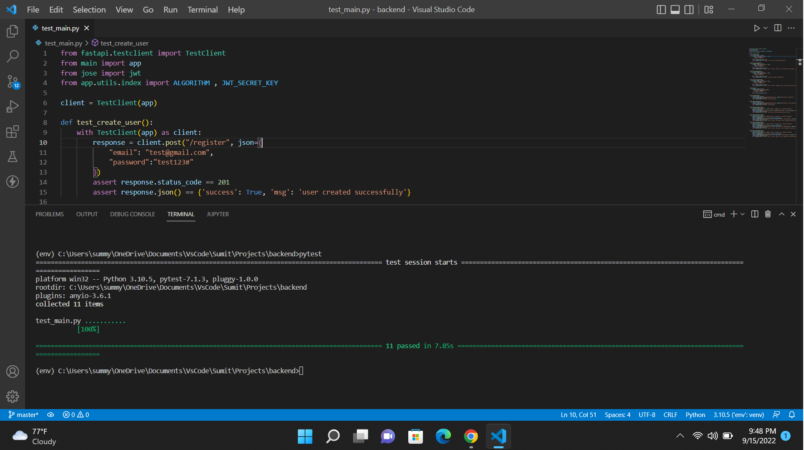
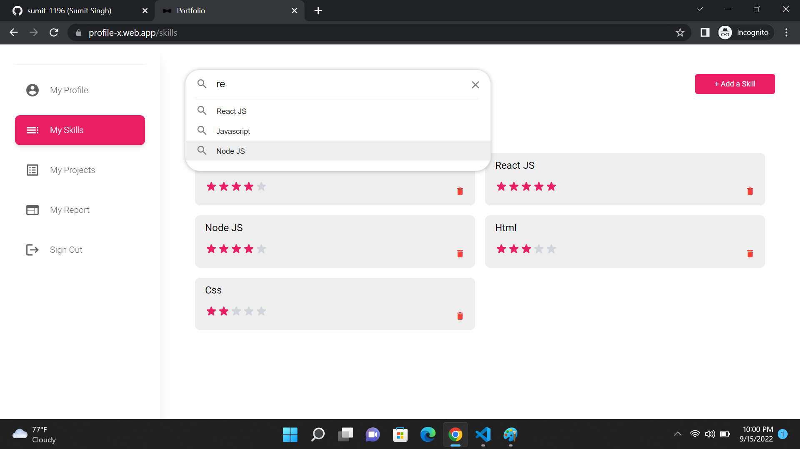
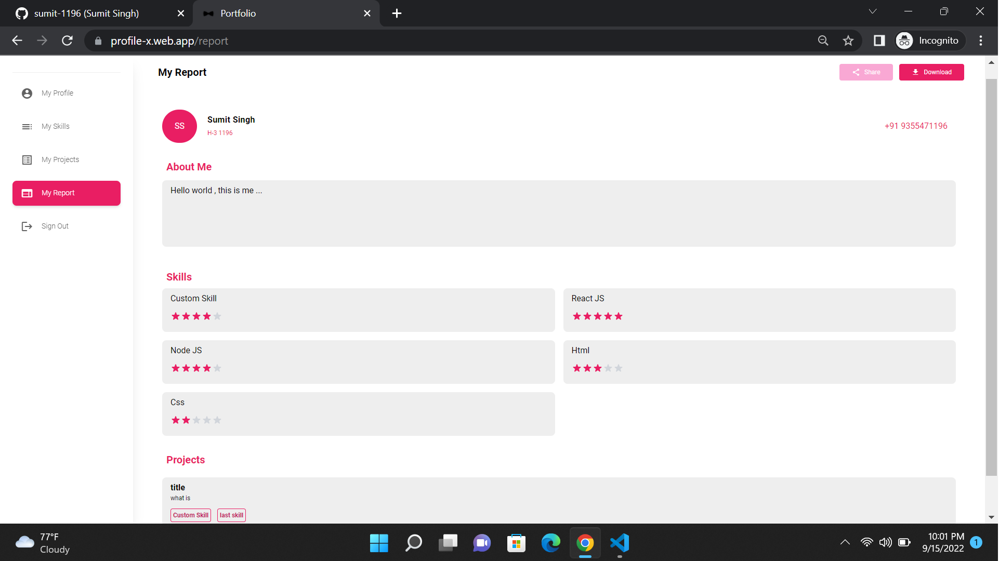

# Portfolio  https://profile-x.web.app/ 

# Backend Setup

With Docker
1. Install docker and docker compose
2. Open backend folder
3. RUN COMMAND :- docker compose up

Without Docker
1. Create virtual environment ( Optional )
2. RUN COMMAND :- pip install -r requirements.txt
3. START SERVER :- uvicorn main:app --reload

# Frontend Setup

1. Open frontend folder.
2. RUN COMMAND :- yarn install
3. START SERVER :- yarn start

# Preview Images

